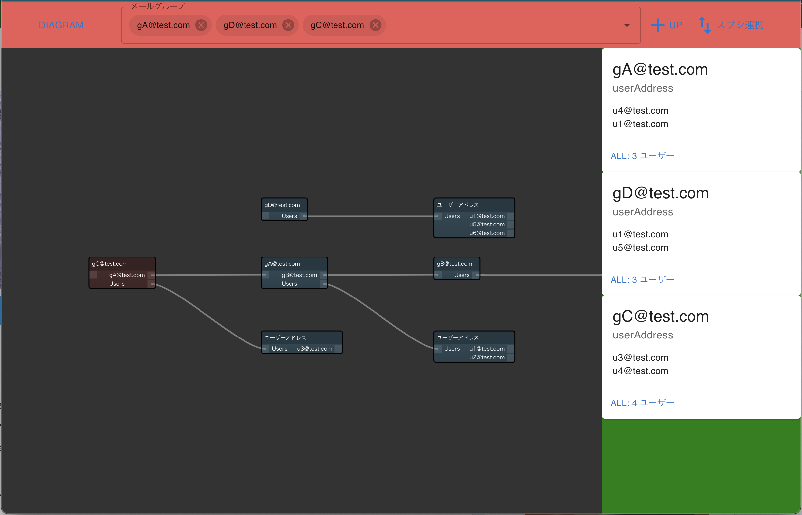
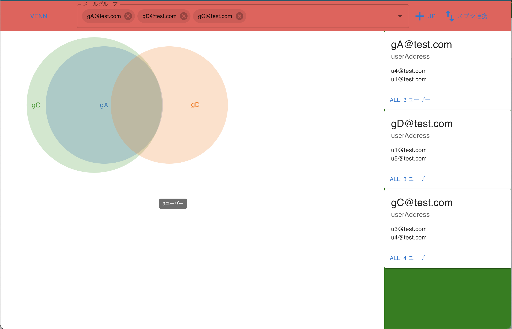

# mailgroupViewer
権限と紐づいた入れ子構造になっているメールグループを視覚的に見やすくわかりやすく表示するためのアプリ
https://masucchi.github.io/MailGroupViewer/

 趣味で作りましたので適当な作りです．

スプレッドシートの連携は　https://docs.google.com/spreadsheets/d/1Sn7bHWY0PsC-uMjwdJvbHTI8kKShJxLS8Bgbijxcf9Q/edit#gid=0

https://codelikes.com/csharp-spreadsheet-api/ 適当にこの辺りを参考にGCP側のAPI等の設定をしてください．　/application/.env にAPIkeyなどを登録して　npm run などで動かせます．（使用するアカウントに対してスプレッドシート側の閲覧権限付与も必要）

## ダイヤグラム表示

## ベン図表示

